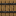

# Villager Trades

##Butcher

####Novice

Item Wanted | Quantity | Item Given | Quantity
:-----------:|:-------------:|:-----------:|:-----------:
Beef | 1 | Bone Meal | 3
Mutton | 1 | Wheat | 6

####Apprentice

Item Wanted | Quantity | Item Given | Quantity
:-----------:|:-------------:|:-----------:|:-----------:
Porkchop | 3 | Barrel | 1

####Journeyman

Item Wanted | Quantity | Item Given | Quantity
:-----------:|:-------------:|:-----------:|:-----------:
Beef | 24 | Dirt | 32
Chicken | 1 | Gravel | 32

####Expert

Item Wanted | Quantity | Item Given | Quantity
:-----------:|:-------------:|:-----------:|:-----------:
Porkchop | 24 | Mud | 32
Mutton | 24 | Podzol | 32

####Master

Item Wanted | Quantity | Item Given | Quantity
:-----------:|:-------------:|:-----------:|:-----------:
Beef | 64 | Emerald | 1
Porkchop | 64 | Emerald | 1
Mutton | 64 | Emerald | 1
Chicken | 64 | Emerald | 1